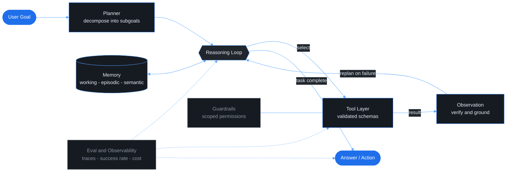

<!-- ===================== HERO BANNER ===================== -->
<div align="center">


<a href="https://git.io/typing-svg">
  
</a>

<br/>


</div>

<br/>

<!-- ===================== ABOUT ===================== -->
## whoami

```python
class Aditya:
    def __init__(self):
        self.role     = "Agentic AI Engineer"
        self.base     = "Full-Stack Developer"
        self.i_build  = ["multi-agent systems", "tool-using agents", "the infra around them"]
        self.i_obsess = "reliability and evaluation over flashy demos"
        self.mission  = "give software agents a body in the real world"

    def ship(self):
        return "agents that hold up in production"
```

I'm an **Agentic AI Engineer** with a full-stack backbone. I design autonomous, multi-agent systems that plan, reason, and use tools, and I build the infrastructure that makes them real, from the model call all the way to the interface a user touches.

The part I actually care about is the hard part: agents that keep their memory intact across long tasks, tool calls that don't shatter on messy input, and orchestration you can still debug when no two runs behave the same. Anyone can demo an agent that works once. I want to know its measured success rate and *why* it moved.

<br/>

<!-- ===================== WHAT I DO ===================== -->
## What I Do

<div align="center">

<p>


</p>
<p>


</p>

</div>

**Building agents that work.** Designing multi-agent systems with real memory, planning, and reliable tool use, then wrapping them in full-stack products that ship.

**Engineering for production.** Treating evaluation, observability, and reliability as first-class, so an agent's behavior is measured and debuggable, not a black box.

**Bridging software to the physical world.** Deeply interested in embodied AI, taking the orchestration I build in software and giving it a way to act in the real world.

<br/>

<!-- ===================== ARSENAL ===================== -->
## Arsenal

**Agentic &amp; LLM Orchestration**

<p align="left">
   
</p>

**Agent SDKs**

<p align="left">
     
</p>

**Core &amp; Infrastructure**

<p align="left">
        
</p>

<br/>

<!-- ===================== ARCHITECTURE ===================== -->
## How I Architect Agents

Not a wrapper around a model call. A system with a control loop, a memory layer, hardened tools, and a measurement layer that tells me when it degrades.



The two boxes most people skip are the two I refuse to: **guardrails** on the tool layer, and **eval plus observability** wrapping the whole loop. An agent you cannot measure is an agent you cannot improve.

<br/>

<!-- ===================== IN MOTION ===================== -->
## In Motion

A short explainer I built in React and Remotion, walking through how an agentic system actually runs a task.

<div align="center">


</div>

<br/>

<!-- ===================== CONNECT ===================== -->
## Let's Build Something

<div align="center">

<a href="https://www.linkedin.com/in/adityaj1808/">
  
</a>
<a href="mailto:aadityaj.sas@gmail.com">
  
</a>
<a href="https://github.com/adityajadhavv18">
  
</a>

<br/><br/>


</div>
